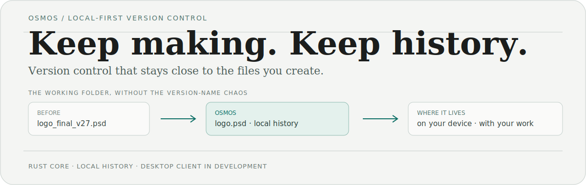

<p align="center">
  
</p>

# Osmos

Osmos; tasarımcılar, yazarlar, editörler ve geliştiriciler gibi dosyalarla üreten kişiler için yerel-öncelikli bir versiyon kontrol projesidir. Sürüm adı karmaşasını, geri dönmesi kolay ve özel bir yerel geçmişle değiştirmek için geliştiriliyor.

> **Proje durumu:** Rust çekirdeği yerel versiyonlama, içerik-adresli blob depolama, SQLite metaverisi ve yerel daemon API’si sağlıyor. Masaüstü deneyimi ile cihazlar arası taşıma katmanı hâlâ geliştirme aşamasında.

## Fikir

Çoğu yaratıcı çalışma bir Git deposuyla değil, bir klasörle başlar. Osmos bu gerçeğe göre tasarlanır:

```text
çalışma klasörü → yerel geçmiş → gerektiğinde önceki bir sürümü seç
```

Amaç basit: geçmişi işinizin yanında tutmak; böylece üretmeye odaklanabilmek.

## Bugün neler var?

| Alan | Mevcut durum |
| --- | --- |
| [Osmos Core](https://github.com/Osmos-App/osmos-core) | Dizin takibi, BLAKE3-adresli bloblar, SQLite metaverisi, commit ve branch işlemleri ile Unix socket daemon içeren Rust çalışma alanı. |
| [Osmos Desktop](https://github.com/Osmos-App/osmos-ts) | Tauri + React + TypeScript istemci temeli; ürün ekranları geliştiriliyor. |
| [Osmos Website](https://github.com/Osmos-App/osmos-website) | Vite, özel CSS token’ları ve Firebase ile hazırlanmış ürün sitesi ve bekleme listesi. |

## Nereye gidiyor?

- Değişiklikleri incelemek, snapshot oluşturmak ve branch’ler arasında gezinmek için sakin bir masaüstü arayüzü.
- Çekirdek çalışma alanında planlanan cihaz keşfi ve eşler arası taşıma.
- Git terminolojisi gerektirmeden yerel geçmişi anlaşılır tutan bir çalışma biçimi.

## Katılın

İlginize en yakın depodan başlayabilirsiniz:

- [Çekirdek motoru inceleyin](https://github.com/Osmos-App/osmos-core)
- [Masaüstü istemci temelini görün](https://github.com/Osmos-App/osmos-ts)
- [Ürün sitesine göz atın](https://github.com/Osmos-App/osmos-website)
- [Katkı rehberini okuyun](https://github.com/Osmos-App/.github/blob/main/CONTRIBUTING.md)

## Güvenlik ve iletişim

Güvenlik açıklarını lütfen herkese açık bir issue açmadan **security@useosmos.com** adresine bildirin. Ayrıntılar için [güvenlik politikasına](https://github.com/Osmos-App/.github/blob/main/SECURITY.md) bakın.

Genel sorular için: **hello@useosmos.com**.
